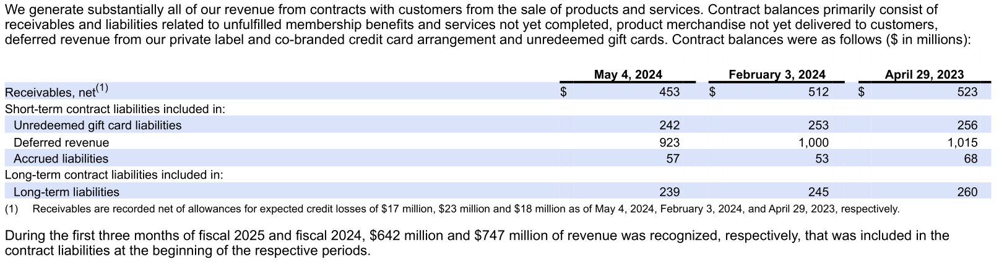
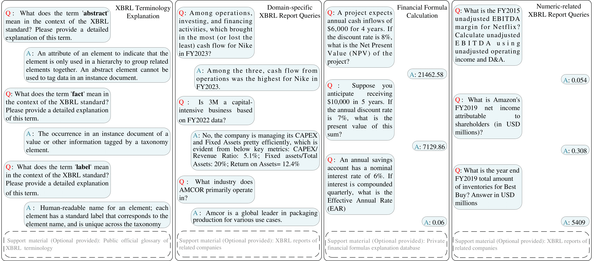
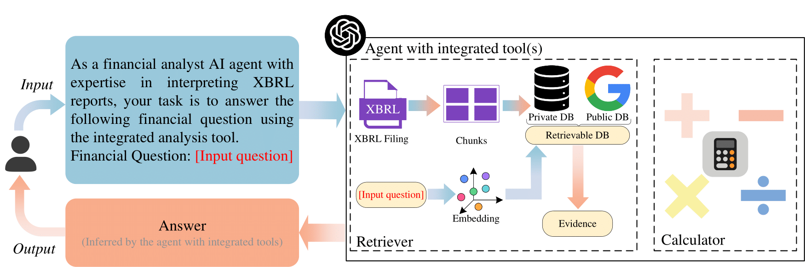
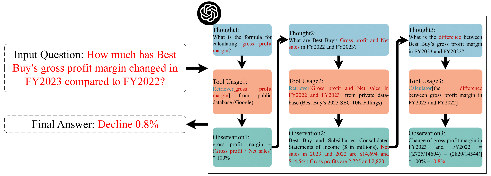

# XBRL-Agent
Here is XBRL-Agent's official GitHub repository.

## What is XBRL?

XBRL (eXtensible Business Reporting Language) is a global standard for digital business reporting, widely adopted by regulators worldwide. It standardizes financial data creation and sharing among investors, regulators, and market participants. XBRL links numerical data to its semantic context, enhancing the interpretability of financial information. The image above shows an example of an XBRL report, taken from Best Buy's SEC-10Q filing.

## What is XBRL-Agent?
XBRL-Agent is a pioneering project that evaluates and enhances large language models' (LLMs) capabilities in analyzing XBRL reports. We address LLMs' limitations in financial domain knowledge and mathematical calculations by integrating external tools like retrievers and calculators within an agent framework. Our experiments demonstrate significant improvements, with accuracy increases of up to 17% for domain queries and 42% for numeric type queries. This work explores LLMs' potential in XBRL analysis and enhances their reliability and robustness through innovative techniques, paving the way for more efficient and accurate processing of business financial reports.

## Datasets

We use four tasks (including three datasets) to evaluate LLMs' ability. Sample questions and answers for four tasks with optional support materials are shown above. Among all the datasets, [XBRL Terminology](https://huggingface.co/datasets/KirkHan/XBRL_Terminology) and [Financial Formula Calculation](https://huggingface.co/datasets/KirkHan/XBRL_Formula_Calculation) are collected by ourselves and have open-sourced on Hugging Face for academic research.

## XBRL-Agent with Tool(s)

The XBRL Agent leverages an agent framework integrated with specialized tools to overcome large language models' (LLMs) limitations in analyzing XBRL reports. To address the lack of financial domain knowledge, a retriever tool using Retrieval-Augmented Generation (RAG) accesses up-to-date information from external databases. For precise numerical calculations, a calculator tool is incorporated. These tools can be used individually or in combination within the agent framework, allowing the system to tackle complex financial queries that require both qualitative understanding and quantitative analysis. This approach significantly enhances LLMs' capabilities in XBRL report interpretation, bringing their performance closer to that of professional financial analysts.

## ReAct Framework: A Step-by-Step Demonstration

We demonstrate the XBRL Agent's capabilities using the ReAct (Reasoning and Acting) Framework. This example showcases how the agent integrates the retriever and calculator tools to solve complex financial problems. The step-by-step process illustrates the dynamic interaction between reasoning and action, highlighting the effectiveness of our approach in enhancing LLM performance for XBRL report analysis.

### Please note that this repository is currently a work in progress. We will be gradually updating the relevant code and information. Stay tuned for future developments and improvements. Thanks!
